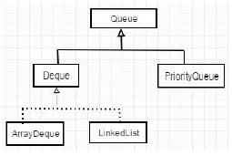
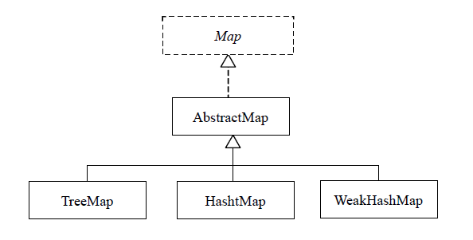

# 泛型

- 定义的泛型参数只能调用Object中的方法
- 泛型类被继承时，如果父类的泛型列表没有被实例化，那么子类的泛型列表中应该包括父类的泛型

## 比较接口

### Comparable接口

**排序接口**

- 强行对实现它的每个类进行整体排序，这种排序被称为类的自然排序

- 需要实现类的`CompareTo(Object o)`方法。

- 能够通过`Collections.sort()`或者`Arrays.sort()`方法进行排序

### Comparator接口

**比较器接口**

- 需要针对排序属性单独编写一个类来实现`Comparator`接口
- 需要实现`int Compare(Object o1,Object o2)`或者`boolean equals(Object obj)`方法

- `o1`比`o2`小返回负数


# 集合

<font color=red>图中虚线框表示接口，实线框表示类</font>

## Collection接口


- Set：元素有顺序，并且元素不可以重复
- List：元素有顺序，元素可以重复

### Collection的核心方法

1. 增加元素，消除元素，判断元素是否存在
2. 返回迭代器接口，把集合转换成数组
3. 集合的大小

| 方法                                | 作用                               |
| ----------------------------------- | ---------------------------------- |
| `boolean add(Object c)`             | 插入单个对象                       |
| `bool addAll(Collections c)`        | 添加集合c中所有的对象              |
| `Object[] toArray()`                | 以数组的方式返回内容               |
| `Object[] toArray(Object[] a)`      | 以数组的方式返回内容               |
| `Iterator<E> iterator()`            | 返回一个实现了`Iterator`接口的对象 |
| `void clear`                        | 清空所有对象                       |
| `boolean remove(Object o)`          | 删除指定对象                       |
| `boolean removeAll(Collection c)`   | 删除c中拥有的对象                  |
| `boolean contains(object o)`        | 检查是否由指定的对象               |
| `boolean containsAll(Collection c)` | 检查是否包含c中所包含的对象        |
| `boolean isEmpty()`                 | 判断集合是否为空                   |
| `int size()`                        | 获取集合中的对象个数               |

<font color=red>注意：</font>第二个`toArray`方法

返回参数中指定类型相同的数组。如果参数中数组过小，会重新生成新足够大的数组。如果参数中数组大小过大，则将最后一个元素之后第一个元素置null。

### 集合的遍历方法

#### 1. 使用for each进行遍历

```java
for(Object o:collection){
    ...
}
```

#### 2.使用迭代器`Iterator`进行遍历

##### 迭代器的常用方法

| 方法                | 作用                                       |
| ------------------- | ------------------------------------------ |
| `boolean hasNext()` | 集合中是否由继续迭代的元素                 |
| `E next()`          | 返回集合中的下一个元素                     |
| `void remove()`     | 删除`next()`方法最后一次从集合中访问的元素 |

### Collections类

> java.util.Collections是一个包装类（工具类），里面包含了很多集合操作的静态多态方法。

**常用方法**

| 方法                                                 | 作用                                   |
| ---------------------------------------------------- | -------------------------------------- |
| `void sort(List<T> list)`                            | 根据元素的自然顺序按升序进行排序       |
| `void sort(List<T> list,Comparator<T> c)`            | 根据比较器顺序对指定列表进行排序       |
| `void reverse(List<T> list)`                         | 反转列表的元素顺序                     |
| `boolean replaceAll(List<T> list,T oldVal,T newVal)` | 使用一个值替换列表中出现的所有某一个值 |
| `void copy(List<T> dest,List<T> src)`                | 将所有元素从一个列表复制到另一个列表   |
| `void fill(List,Object)`                             | 用指定对象填充`List`容器               |

### Set接口

> 派生了一个`SortedSet`接口，一个抽象类`AbstractSet`。
>
> `SortedSet`接口用来描述有序的集合元素
>
> 抽象类`AbstractSet`实现了Collection接口，并且有一个子类HashSet，通过散列的方式来表示集合内容

> Set接口是一种无序且不重复的子接口，它继承了Collection接口中的所有方法

#### HashSet

> HashSet按照**哈希算法**来存取集合中的元素，当向Set集合中添加一个元素时，HashSet调用该元素的`hashCode()`方法，获得哈希码，然后根据这个哈希码计算出该元素在集合中的存储位置。HashSet**不保存元素的添加顺序**，并且元素不重复。

HashSet中的方法与Collection中的方法相同，并且继承了Object中的方法。

默认构造函数将构造一个默认容量为16，加载因子为0.75的新集合。

#### TreeSet

> TreeSet同时实现了Set接口和SortedSet接口（Set子接口，可以实现集合进行自然升序排序），因此使用TreeSet类实现的Set接口默认情况下是按照存储类的自然排序来排序，因此存放的元素必须指定排序规则

**TreeSet实现自然排序或者指定比较器。**

##### 构造方法

| 构造方法                   | 作用                                                         |
| -------------------------- | ------------------------------------------------------------ |
| `TreeSet<T>()`             | 构造一个空树集，对元素按自然排序排序                         |
| `TreeSet<T>(Collection c)` | 构造一个树集，并添加集合c中的所有元素，对元素按照自然排序排序 |
| `TreeSet<T>(Comparator c)` | 构造一个树集，并按指定的比较器排序                           |
| `TreeSet<T>(SortedSet s)`  | 构造一个树集，添加有序集合s中的所有元素，并且使用s想用的比较器排序 |

##### 常用方法

| 方法                                             | 作用                                                |
| ------------------------------------------------ | --------------------------------------------------- |
| `E first()`                                      | 返回有序集合中的第一个元素                          |
| `E last()`                                       | 返回最后一个元素                                    |
| `SortedSet<E> subSet(E fromElement,E toElement)` | 返回子集合序列，从`fromElement`到`toElement`        |
| `SortedSet<E> headSet(E toElement)`              | 返回集合中小于`toElement`的一个子序列               |
| `SortedSet<E> tailSet(E fromElement)`            | 返回有序集合中大于等于`fromElement`元素的一个子序列 |
| `Comprator<E> comparator()`                      | 返回集合的比较器                                    |

> 在需要大量快速检索和排序信息的时候适合用TreeSet

#### LinkedHashSet

> 扩展了HashSet类，没有添加自己的属性和方法，它根据哈希码进行存放，同时用链表记录元素的加入顺序，当迭代器遍历LinkedHashSet时元素将按照插入顺序进行返回。

底层采用了双向链表进行实现，保证了元素的插入顺序，由因为是HashSet的子类，所以插入的元素不能重复。

### List接口

> 包含有序元素的一种Collection接口的子接口，元素之间的顺序可以由插入的时间先后决定,也可以由元素值的大小决定，元素可以重复。

> 因为元素是有序的，所以可以根据索引位置来检索List集合中的元素。

> List接口的实现类有`ArrayList` `LinkedList` `Vector` `Stack`几个泛型类

#### LinkedList

> 提供双向链表实现数据存储方式，可以按照索引号检索数据，并且能够向前，向后遍历

##### 常用方法

| 方法                              | 作用                          |
| --------------------------------- | ----------------------------- |
| `boolean add(Object o)`           | 向链表末尾添加一个新结点      |
| `boolean add(int index,Object o)` | 将对象o插入指定位置           |
| `boolean addFirst(Object o)`      | 将对象o添加到链表头部         |
| `boolean addLast(Object o)`       | 将对象o添加到链表尾部         |
| `boolean clear()`                 | 删除链表所有的结点            |
| `Object remove(int index)`        | 删除指定位置上的结点          |
| `Object remove(Object o)`         | 删除首次出现o的结点           |
| `Object get(int index)`           | 返回链表index处的结点         |
| `E getFirst()`                    | 取链表的第一个元素            |
| `E getLast()`                     | 取链表的最后一个元素          |
| `int indexOf(Object o)`           | 查找元素o，返回位置           |
| `int lastIndexOf(Object o)`       | 从最后开始查找元素o并返回位置 |
| `E removeFiest()`                 | 删除链表首元素                |
| `E removeLast()`                  | 删除链表尾元素                |
| `E set(int index,E o)`            | 修改指定位置的元素值          |
| `int size()`                      | 链表长度                      |

#### ArrayList

> 是List接口的一个可变长数组的实现（每次增长50%的容量），地址是连续的，线程不安全。

> ArrayList查找速度较快，但是删除和插入结点速度较慢

如果需要插入大量元素时，可以指定初始的大小来提高效率。

常用方法方法跟`LinkedList`类似

#### Vector

> 与ArrayList类似采用顺序存储，但是它线程安全，每次增长100%的容量。

##### 特殊的常用方法

| 方法                                        | 作用                                |
| ------------------------------------------- | ----------------------------------- |
| `void copyInto(Object anArray[])`           | 将向量中的元素复制到anArray数组中   |
| `Object elementAt(int index)`               | 返回向量下标为index对应的元素       |
| `void setElementAt(Object o,int index)`     | 将对象obj放在index位置              |
| `void removeElement(int index)`             | 删除index位置的元素，其他元素向前挪 |
| `void inserteElementAt(Object o,int index)` | 在index位置插入一个元素             |
| `void addElement(Object o)`                 | 将对象o追加在向量尾部               |
| `boolean removeElement(Object o)`           | 删除第一次出现的o对象               |
| `Object get(int index)`                     | 返回下标为index的元素               |
| `boolean add(Object o)`                     | 将对象o追加在向量尾部               |
| `void add(int index,Object o)`              | 将新元素添加到指定位置              |
| `Onject remove(int index)`                  | 删除index位置的对象                 |
| `String toString() `                        | 将向量元素用字符串表示              |

#### Stack

> 它是Vector的子类，继承了Vector的方法

相对于Vector新增的堆栈操作方法：

| 方法                      | 作用                                                      |
| ------------------------- | --------------------------------------------------------- |
| `Object push(Object o)`   | 将对象压入栈中                                            |
| `Object pop()`            | 将栈顶元素弹出                                            |
| `boolean empty()`         | 判断栈是否为空                                            |
| `Object peek()`           | 查看栈顶元素                                              |
| `int search(Object data)` | 获取数据在栈中的元素，最顶端为1，向下递增，若未找到返回-1 |

### Queue接口



> 队列继承Collection接口，除了继承Collection接口中的方法以外，还提供了队列操作

> 双端队列Deque接口继承Queue接口，支持从两端插入删除元素，它同时实现了Stack和Queue的功能

> ArrayDequ泛型类和LinkedList泛型类时Deque的两个实现类，既实现了队列的线性存储和链式存储，同时也可以用于堆栈操作。

> 优先队列PriorityQueue泛型类是Queue接口的实现类。

#### ArrayDeque

> 采用了循环数组的方式来实现双端队列，可以自动增加队列长度，类中不能存储null元素

##### 常用方法

| 方法                    | 作用                   |
| ----------------------- | ---------------------- |
| `boolean add(E e)`      | 添加指定元素到队尾     |
| `boolean addFirst(E e)` | 将添加指定的元素到队首 |
| `void clear()`          | 清除所有元素           |
| `E peek()`              | 返回队首元素           |
| `E peekLast()`          | 返回队列的最后一个元素 |
| `E poll()`              | 删除队列首元素，并返回 |
| `E pollLast()`          | 删除队列的最后一个元素 |
| `E pop()`               | 弹出队首元素           |
| `void push(E e)`        | 加入元素               |
| `int size()`            | 返回队列元素个数       |

#### PriorityQueue

> 优先队列的作用是保证每次取出的元素都是队列中权值最小的元素，底层是一颗完全二叉树。

常用方法与Queue接口类似

## Map接口 



- Map：由键值对(Key-Vaule)组成，键不能重复，值可以重复

> Map接口是独立的接口，不继承Collection接口。它只要是有两个实现类：HashMap和TreeMap。
>
> HashMap按照哈希算法来存取键对象。
>
> TreeMap可以对键对象进行排序。

### Map接口的主要方法

| 方法                                           | 作用                                  |
| ---------------------------------------------- | ------------------------------------- |
| `void clear()`                                 | 清空HashMap，将所有元素设位null       |
| `boolean containsKey(Object key)`              | 判断HashMap是否包含key                |
| `boolean containsValue(Object value)`          | 判断HashMap是否包含值为value的元素    |
| `V get(Object key)`                            | 获取Key所对应的value                  |
| `boolean isEmpty()`                            | 当前如HashMap类对象是否为空           |
| `V remove(Object key)`                         | 删除键为Key的元素                     |
| `int size()`                                   | 返回当前映射的大小                    |
| `V put(K key,V value)`                         | 将key-value键值对放入HashMap中        |
| `void putAll(Map<K,V> m)`                      | 将m中全部的元素取出添加到HashMap中    |
| `Collection<V> values()`                       | 将当前映射的所有value以集合的方式返回 |
| `Set<K> keySet()`                              | 将当前映射的所有key以set集合方式返回  |
| `V replace(K key,V value)`                     | 取代HashMap中Key对应的Value           |
| `boolean replace(K key,V oldValue,V newValue)` | 用newValue取代Key中的oldValue         |
| `Set<Map.Entry<K,V>>entrySet()`                | 返回一个集合，拥有HashMap的所有元素   |

### Map的遍历方式

假设Map对象为mp，存储的Key为Integer类型，value为String类型

1. 通过`entrySet()`方式遍历Map键值对

   ```java
   Set<Map.Entry<Integer,String>>st = mp.entrySet();
   Iterator<Map.Entry<Integer,String>> st = st.iterator();
while(it.hasNext()){
       Map.Entry<Integer,String> me = it.next();
       System.out.println(me.getKey()+"   "+me.getValue());
   }
   ```
   
2. 通过`KeySet()`方法遍历Map的键

   ```java
   Set<Integer>st = mp.keySet();
   for(Integer s:st){
       System.out.println(s);
   }
   ```

   或者使用迭代器

   ```java
   Iterator<Integer> it = st.integer();
   while(it.hasNext()){
       System.out.println(it.next());
   }
   ```

   得到键以后可以使用`get(key)`的方法来得到对应的值

3. 通过`values()`方法遍历Map的值

   ```java
   Collection<String>st = hm.values();
   for(String:st){
       System.out.println(s);
   }
   ```

   或者使用迭代器

   ```java
   Iterator<String>it = st.iterator();
   while(it.hasNext()){
       System.out.println(it.next);
   }
   ```

### HashMap

> HashMap类是泛型类，是AbstractMap的子类，同时实现了泛型Map接口、Cloneable接口和Serializable接口

> HashMap基于Hash码存储元素，它允许键为null，如果经常需要添加、删除和定位银蛇关系，可以使用HashMap类，但在遍历HashMap类对象中的元素得到的映射是无序的。

### LinkedHashMap

> 它是HashMap的子类，它是有序的，因为它实现了元素的链式存储，它通过维护双向循环链表定义了迭代顺序。

> LinkedHashMap允许Key和Value为空，并且允许Key重复，但是重复了会覆盖前面出现的Key

### TreeMap

> 它实现Map接口和SortedMap接口

> 基于红黑树实现，该映射关系根据键的自然排序进行排序，或者根据创建映射时提供的比较器进行排序。

> 它不允许键为null，因为需要排序，因此需要键必须为可排序的。

构造方法与TreeSet类似，只是Collection换成了Map。

#### TreeMap的特殊方法

| 方法                                       | 作用                                 |
| ------------------------------------------ | ------------------------------------ |
| `Comparator <E> comparator()`              | 获取TreeMap使用的比较器              |
| `K firstKey()`                             | 获取第一个对象的Key                  |
| `SortedMap<K,V> headMap(K toKey)`          | 获取一个子集，其对象的Key小于toKey   |
| `SortedMap<K,V> subMap(K fromKey,K toKey)` | 返回小于toKey大于等于fromKey的子映射 |
| `SortedMap<K,V> tailMap(K fromKey)`        | 返回Key大于等于fromKey的一个子映射   |
| `Entry<K,V> firstEntry()`                  | 获取第一个键值对                     |
| `Entry<K,V> lastEntry()`                   | 获取最后一个键值对                   |
| `K lastKey()`                              | 获取最后一个Key                      |

